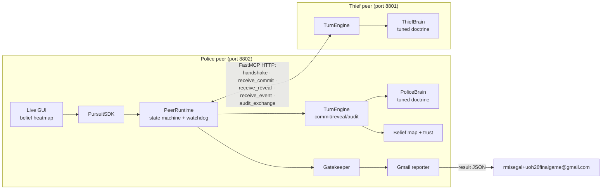
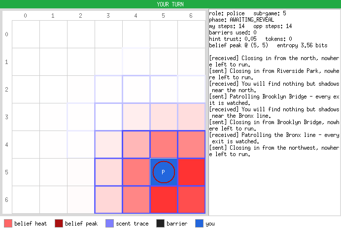
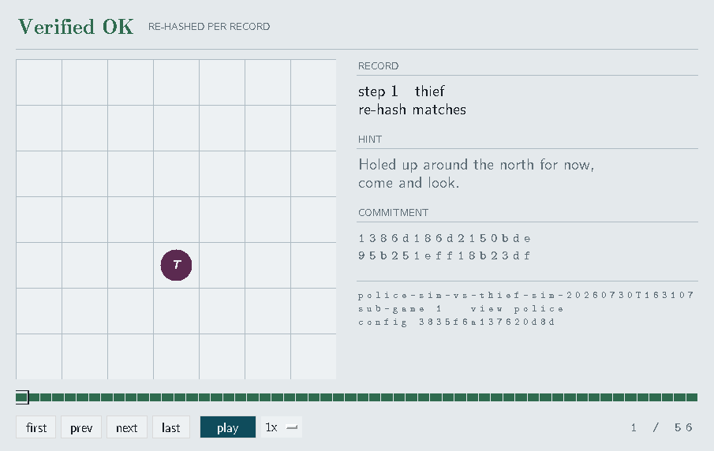
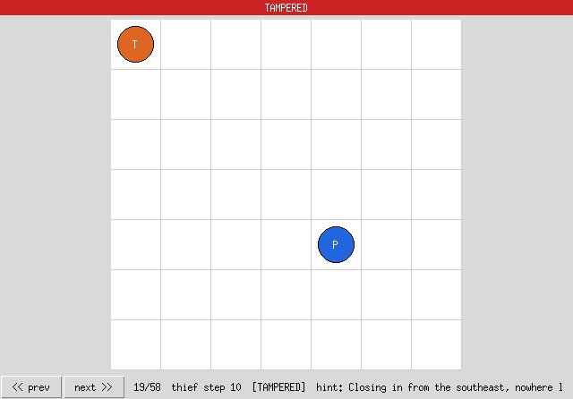

# p2p-pursuit — Distributed Cops-and-Robbers over a Peer-to-Peer Network

> **Role of this repository: THIEF agent** — `uv run p2p-pursuit peer` defaults to `--role thief` here (`ROLE` marker). Sister (police) repository: https://github.com/yosefshanaa/p2p-police-agent

Final project for Dr. Yoram Segal's **"Orchestration of AI Agents"** course, University of Haifa
(rules book `police_thief_p2p.pdf` **v3.0.0**, bundled in the reference repo
[`rmisegal/Game-P2P-Cop-Chase`](https://github.com/rmisegal/Game-P2P-Cop-Chase)).

Two fully autonomous, symmetric AI peers — a **Police** and a **Thief** — chase each other on a
7×7 grid with **no referee and no central server**. Each peer is simultaneously a **FastMCP
server and client**. Neither side ever sees the opponent: each fuses the opponent's decaying
**pheromone field** with free-language **hints that may lie** into a **Bayesian belief map**.
Honesty is enforced by mathematics: every step is sealed with **SHA-256 commit → acknowledge →
reveal → mutual audit**; any tampering is a technical loss, no appeal.

**Team `ahk-yosi`** — Yosef Shanaa (`213314859`) · Ahmad Kaiss (`325811255`).
**Sister repositories** (submission split, book rule #49): police repo
<https://github.com/yosefshanaa/p2p-police-agent> · thief repo
<https://github.com/yosefshanaa/p2p-thief-agent> — both published from this codebase by
`scripts/sync_repos.py`; each carries a `ROLE` marker that sets its default `peer` role.

---

## Table of contents

1. [The game as a Dec-POMDP](#1-the-game-as-a-dec-pomdp)
2. [Architecture & FastMCP orchestration dilemmas](#2-architecture--fastmcp-orchestration-dilemmas)
3. [Strategies implemented](#3-strategies-implemented)
4. [Reinforcement learning](#4-reinforcement-learning)
5. [Screenshots](#5-screenshots)
6. [Status](#6-status)
7. [Installation](#7-installation)
8. [Usage](#8-usage)
9. [Configuration guide](#9-configuration-guide)
10. [How a turn works](#10-how-a-turn-works)
11. [Repository layout](#11-repository-layout)
12. [Documentation map](#12-documentation-map)
13. [Interpretation log](#13-interpretation-log-academic-freedom-book-p-5)
14. [Secrets & Gmail](#14-secrets--gmail)
15. [League play & submission](#15-league-play--submission)
16. [Match record](#16-match-record)
17. [Contributing](#17-contributing)
18. [License & credits](#18-license--credits)

---

## 1. The game as a Dec-POMDP

The system is a two-agent **decentralized partially observable Markov decision process**
⟨I, S, {A_i}, T, {R_i}, {Ω_i}, {O_i}, h⟩:

- **Agents** `I = {Police, Thief}` — no third party exists at runtime; every rule the referee
  would enforce is replaced by cryptography (§2, dilemma D1).
- **State** `S`: both positions, the barrier set (police quota 14), both pheromone fields
  `τ_P, τ_T ∈ [0, 0.9]^{7×7}`, step counter, and protocol phase. *Neither agent ever holds `S`* —
  each holds only its own half plus a belief over the other's.
- **Actions** `A_i`: `{N, S, E, W, STAY}` (no diagonals); the police may instead forfeit the
  move to place a barrier on its own or a 4-adjacent cell (truthfully declared, permanent).
  Alongside the move, each agent chooses a **free-language hint** (≤15 words, *may lie*) with a
  sealed truth-intent flag — the hint channel is itself part of the action space.
- **Transition** `T`: deterministic movement/blocking; pheromone dynamics are fixed and public —
  5×5 emission kernel (focal 0.9) then multiplicative decay `ρ = 0.10` (0.9 → 0.81), locked
  before play by an exchanged hash of the model document.
- **Observations** `Ω_i, O_i`: own state, the opponent's **served scent field** (pre-emission,
  so the freshest visible cell ≈0.81 marks where the opponent *was*), the opponent's hint
  (adversarial channel), and protocol events — barrier declarations, capture claims (a claim
  legitimately leaks the claimant's cell), and denied claims as negative evidence.
- **Rewards** `R_i`: capture 20/5, survival at 35 steps 5/10, proven tamper 0/0 (both zeroed),
  and — at series level, not per sub-game — 2/2 if the aggregate ends level. A match is a
  best-of-6-sub-game series; horizon `h` = 35 steps per sub-game.
- **Belief state**: each peer maintains an exact discrete Bayes filter over the 49 cells —
  scent likelihood (`τ^8` sharpness) → motion-model diffusion → trust-weighted hint update,
  with a trust coefficient driven by a contradiction detector (`domain/belief.py`,
  `domain/trust.py`). The brains (§3) act on this belief, never on ground truth.

## 2. Architecture & FastMCP orchestration dilemmas



Full C4, state-machine and sequence diagrams: [`docs/PLAN.md`](docs/PLAN.md) §2. The dilemmas a
referee-less FastMCP orchestration forces, and how this project resolves them:

- **D1 — Who is the referee?** Nobody. Every judgment call (legality, capture, scoring) is made
  twice, independently, and reconciled by the **mutual audit**: after each sub-game the peers
  exchange full sealed logs (nonces included) and re-verify every hash, move legality, scent
  arithmetic and claim answer. One mismatch ⇒ `TAMPERED` ⇒ 0/0.
- **D2 — Symmetric server *and* client.** Each peer must serve MCP tools while calling the
  opponent's. Startup order is unknowable ⇒ retry-until-up connection, `health_check` probes,
  and a handshake that locks a byte-identical constitution by `config_sha256` (refuse on
  mismatch) before any turn.
- **D3 — Turn-taking without a shared clock.** Strict alternation is enforced by an explicit
  state machine (illegal transitions rejected), a per-turn deadline tracker, and a watchdog:
  silence past `turn_timeout_seconds` is a technical loss, persisted before shutdown.
- **D4 — Cross-peer record ordering races.** Two HTTP clients interleave: a capture claim sent
  *after* a reveal once misaligned positional audit pairing and produced a false `TAMPERED`.
  Resolved structurally — claims ride *inside* the reveal (the answer returns atomically in the
  reveal response) and the audit pairs records **content-addressed by digest**, not by position.
- **D5 — Information-release fairness.** A naive reveal of moves would collapse partial
  observability (interpretation #1, §13). The per-step reveal discloses only the public
  projection; moves, positions, intents and nonces stay sealed until the audit — binding first,
  disclosure last.
- **D6 — External-service discipline.** Every outbound call (Gmail, LLM banter) passes a
  **Gatekeeper**: daily quota + token bucket + DoS lock, with a bounded FIFO overflow queue
  (backpressure, never silent drops) and versioned limits in `config/<role>/rate_limits.json`.

## 3. Strategies implemented

The graded core. Full doctrine, tuning history and evaluation evidence:
[`docs/STRATEGY.md`](docs/STRATEGY.md).

**Reading the opponent — the scent field is invertible, so we invert it.** Both brains used to
estimate the opponent's cell as `argmax` of its served scent field. Replayed against the ground
truth in our own 81 sealed sub-games, that names the emitter **219 times in 1,935** — 11% — because
the field *saturates*: emission adds the book's kernel and clamps at 0.9, so 91% of served fields
have between 6 and 20 cells tied at the maximum and `max()` returns whichever the row-major scan
reaches first. But one step of the model is a known function of exactly one unknown, so
[`domain/scent_locate.py`](src/p2p_pursuit/domain/scent_locate.py) replays `ScentField` forward
from the previous field for each of the 49 candidate centres and keeps the one that reproduces
what arrived. Against the same archive: **1,935 of 1,935, exactly.** Replaying the model itself
makes it model-agnostic — whichever physics was negotiated is the one inverted — and the only
difference between them is the lag (`book_v1` serves before emitting, so the fix is one step old;
the other two serve after, so it is current). It cuts both ways, and the doctrine assumes it
does: our own cell is equally readable, so the thief's defence is geometry, not concealment.

**Police — pounce, then squeeze.** The archive's verdict was that the police was not failing to
*find* the thief but to *convert*: 76 turns began with the thief one step away and 11 ended on its
cell, while 27 were spent placing a barrier — which forfeits the move — from a cell right beside
it. So a capture now takes precedence over everything: step onto the cell and claim it, because
rule #21 (a truthful answer to a claim) is load-bearing for the protocol and every peer
implements it, while rule #46 (a barrier onto the thief) is optional and several peers ignore it.
Pursuit scores the ground taken from the thief (`w_cut`, a Voronoi split), not just the distance
closed — pure distance is a tail chase between equal-speed agents, and against gal-roy1 the gap
sat at 2 for 45 of 102 turns while 27 barriers bought zero chances. Thresholds remain **ratios of
a rolling window of recent belief peaks**, ambush lasts exactly one turn, ties break against
reversing, and once the gap stops closing the doctrine switches to the book's third capture path
(§3.4): close the evader's exits one at a time. Flood-fill vetoes self-trapping placements, a
pocket is refused unless the thief could be *in* it, and an enclosed opponent is *claimed* —
naming the cell from the fix, not from an 11%-accurate argmax, since that claim is audited.

**Thief — evasion against an opponent that can see you.** Candidates are scored by the police's
projected belief mass within claim range (BFS ≤ 2), by two-ply mobility, and by the room we own
— but the room is now counted only where we can reach it *without walking through* the pursuer's
next-step reach, which is what a corner actually collapses and what a plain Voronoi count walks
straight through (79% of this thief's archived deaths are on the bottom or right edge). The term
that answers how it dies is `w_strike`: never end the move inside the cells the pursuer can take
next — 43 archived turns did, and 14 ended the sub-game. The same map answers a second question
for free, since the cells a pursuer can *bar* are exactly the cells it can step onto; that seal
term is gated on whether enclosure was agreed, because where it was not, a sealed pocket is a
*survival*. Plus juking only under genuine close pursuit, corner discipline scaled by the
pursuer's remaining (publicly declared) quota, never STAY twice, and **scent-consistent lies**
sampled with a private RNG.

**Evidence.** Validation seeds unseen by both the search and its hold-out, scored in league points
against a population of 22 opponents — archetypes *and* every team we have played, under both
negotiated claim regimes (not self-play — see §4): **11.79 → 14.07 points/sub-game, capture
58.9% → 86.8%, survival 92.7% → 97.9%**. The police creates 2.3× as many capture chances while
spending five times fewer barriers (3.89 → 0.75 per sub-game). Four co-evolution rounds, each
hold-out gated and each starting from the last so that "ourselves" is the *improved* opponent; the
search reinforced the thief's new safety term twice unprompted (`w_strike` 4.0 → 4.79 → 8.13).
Live against the reference implementation: police 5/5 captures, thief never caught. Full tuning
history — including the negative results that cost real effort, the two hand-measured verdicts the
search overturned, and the two holes found *in the objective itself* —
[`docs/STRATEGY.md`](docs/STRATEGY.md).

## 4. Reinforcement learning

**Used, offline, in the policy-search family — and deliberately never during a match.**
Package: [`src/p2p_pursuit/learn/`](src/p2p_pursuit/learn/). Method: the cross-entropy method
over the doctrine vector, plus behaviour cloning of real opponents from sealed match logs.

**Why not online.** The league grants at most ten counted games, one per opponent, each sealed
after reporting. That is ten terminal rewards against ten different non-stationary opponents —
far too few to fit anything, and every sample is irreversible. Worse, a policy that updates
mid-league means the version that earned game 3 is not the version playing game 7, which the
per-sub-game `github_commit` in the report is supposed to pin down. So the agent that plays a
counted match is **frozen**: `config/doctrine.json`, committed, reproducible from the hash.

**What is learned.** Every constant either brain reads is a field of
[`strategy/params.py`](src/p2p_pursuit/strategy/params.py) (23 dimensions), and CEM samples
policies, keeps the elite quarter, and refits the sampling distribution. Three properties make
it honest on a noisy objective, and each is asserted by a test: **common random numbers** (every
candidate in a generation is judged on the same seeds, so comparing them is not comparing luck),
**elitism** (the incumbent is re-scored every generation and competes), and a **variance floor**
(without it the distribution collapses into the first plausible basin and stops searching). The
objective is *league points per sub-game*, not capture rate — the table pays 20/5 as police and
5/10 as thief, so a doctrine can win the capture metric and lose the league.

**Why the opponent pool is the real contribution.** Self-play here is a measured liar: the v5
police scored 90–98% against our own thief and **0/5** against the live reference peer, because a
simulation containing one evader teaches you about that evader. Candidates are therefore scored
against a population of archetypes — random walker, momentum runner, distance-gradient chaser and
fleer, trail hound, barrier-spender, mobility-preserving holder, an `interceptor` that inverts the
scent field as we do, and ourselves — plus every real team we have played, each declaring *which
roles it is genuinely distinct in*, because listing an archetype in a role where it plays an
identical trajectory would silently triple that behaviour's weight in the objective.

**And why the objective itself needed auditing.** A thief search returned nothing — 9.941 → 9.971
points — because sixteen of seventeen pool members scored a flat 10.00 against our evader, and an
objective that cannot tell two thieves apart cannot improve one. It duly spent its freedom driving
`corner_penalty` to 0.001, never having been shown a pursuer that could punish a corner. Two
holes, both found by asking why the lab said our thief was caught once in a hundred sub-games
while the wire said 14 in 35. The lab was not playing the league's rules — whether the police
claims every turn is negotiated per opponent, our contracts are split on it, and the lab defaulted
to *off*, which deletes the police's main conversion path; both regimes are now played, split by
seed. And no pool member knew where the thief was, since every one of them navigated by the
estimator the archive condemned. Building the fix produced a result worth keeping on its own: **a
pursuer that knows the thief's exact cell and simply walks at it catches our evader 0 times in
12** — two equal-speed agents on open ground never meet, and captures come from taking the room
away.

**Learning between matches (the part that compounds).** After the audit exchange, a sealed log
holds the opponent's exact position and move at every step — the protocol hands us a labelled
dataset of a real team, and 81 sub-games of one about ourselves. Three commands use it:

```bash
uv run p2p-pursuit learn review                                  # read the archive back as evidence
uv run p2p-pursuit learn record --name <team> --match matches/<dir>   # their decisions -> a partner
uv run p2p-pursuit learn tune  --role police --workers 12        # search, hold-out gated
```

`review` is read-only and is where every number in this section comes from. `record` builds the
third and strongest kind of sparring partner: a fitted linear clone reproduces about three moves
in four, and a fixed script is honest only for a deterministic opponent (of eight teams, only
gal-roy1's thief and s82kma9e's police qualify), so a *reactive* team is modelled instead by
keeping every observed decision and replaying the move it played from the nearest state we ever
saw it in — 95%/99% of held-out decisions for the reference peer, 87%/100% for orcai-mj.

`tune` writes `config/doctrine.json` **only if a hold-out seed set the search never saw
improves** — a gain on the training seeds is the optimizer reporting its own noise back.

**A doctrine belongs to a scent physics, so there is one per model.** The league's shared kit
registers a second physics (`subtractive_chebyshev_v1` — flat rings, *subtractive* decay), and
searching under it produced `config/doctrine-subtractive.json`. The measurement overturned the
prediction that drove the work: hold-out points per sub-game came out **13.19** at home,
**14.11** for the same doctrine under the foreign physics, and **14.94** once re-searched
there — a brighter, flatter field helps our police (capture 77% → 98%) more than its extra
leakage hurts our thief. Either doctrine loses 0.4–0.8 points under the other's physics and
*says nothing*, so `P2P_SCENT_MODEL` and `P2P_DOCTRINE` are set together or not at all
([`docs/STRATEGY.md`](docs/STRATEGY.md) §9).

Two things are still not RL and are not claimed as such: the per-turn move remains deterministic,
auditable Python over an exact Bayes filter (rule #25 — the LLM only ever writes banter), and the
sub-game trust coefficient adapts online by Bayesian update, not by reward.

## 5. Screenshots

*(Mandatory evidence, all captured live on this codebase — a real two-peer match over localhost
MCP, the replay/tamper drill, and the terminal of a counted league match against a real opposing
team.)*

### Live GUI — Bayesian belief heatmap (local truth only)



Police peer during sub-game 5 of a live two-peer match (`uv run p2p-pursuit peer --role
police`, thief running as a separate process). Red mass = posterior over the thief's cell
after fusing scent + hints; **the opponent's true position is never rendered** (rule #8–9).
Violet cell outlines are the opponent's served **scent trace** (the 5×5 emission block is
clearly visible), the dark-red ring marks the **belief argmax** — here the police is
standing on it — and the side panel reports `belief peak @ (5, 5)  entropy 3.56 bits`
alongside the sent/received hint feed (the thief's contradictory hints have collapsed hint
trust to 0.05, so the belief leans on scent). Green `YOUR TURN` banner, (row, col)
coordinate labels matching the logs, and the color legend strip round out the frame.

### Replay viewer — sealed log verifies clean



`uv run p2p-pursuit replay --log <match>/log_*_g01.json` — frame 35/58 of a finished
sub-game. Every step re-hashes against its sealed commit; the green banner is the whole-log
verdict, the per-frame `[Verified OK]` stamp is that step's re-check. The header pins the
match identity (game id, sub-game, perspective, agreed `config_sha256` prefix); the timeline
is scrubbed with the slider, the `|< << >> >|` buttons, arrow keys, or auto-play at
0.5×–4×. Post-game replay is the only place both trajectories are legitimately visible.

### Replay viewer — tamper drill catches a forged record



Same log, one field doctored: the thief's step-10 `pos_after` was forged to the far corner.
The SHA-256 re-hash mismatches its commit at frame 19 — red `TAMPERED` banner, per-frame
`[TAMPERED]` stamp, and the headless run exits with code 3 (`"verdict": "TAMPERED"`).
A forged match is void: technical loss 0/0, no appeal (rule #20).

### League match terminal — the counted run, and Gmail's own receipt

The counted match against `orcai-mj` was archived with its full terminal transcript — captured as
text rather than as a screenshot, and better for it: every line is greppable, and the artifacts it
names re-verify offline years after the tunnel is gone.

| Evidence | Where | Value |
|---|---|---|
| League match terminal | [`matches/…-orcai-mj-counted/terminal.log`](matches/ahk-yosi-vs-orcai-mj-counted/terminal.log) | 2,073 lines: handshake, all six sub-games, both audits, the filed report |
| Gmail send id | same file, line 1836 | `19ffcbcac8890b74` — `labelIds: ['SENT']`, `mode: 'send'` |

Its closing lines, verbatim:

```text
[police] sub-game 6: capture winner=police (barrier onto (6, 5)) audit=Verified OK
2026-08-13 23:07:29,822 googleapiclient.discovery_cache INFO file_cache is only supported with oauth2client<4.0.0
[email] {'delivered': True, 'receipt': {'id': '19ffcbcac8890b74', 'threadId': '19ffcbcac8890b74', 'labelIds': ['SENT']}, 'mode': 'send'}
```

`labelIds: ['SENT']` is Gmail's own acknowledgement, not ours — the reporter cannot forge it, and
a dry run (the stand-in when Gmail is unreachable) is labelled `dry-run` instead, so the two can
never be confused. The full result JSON is printed immediately below it in the transcript.

The `G012` and `saedshki` counted runs were not archived this way: `logs/` is git-ignored, so a
transcript only survives if it is copied into the match directory the way this one was. Their
evidence is the sealed artifact set under [`matches/`](matches/) instead, which is the stronger
record anyway — `p2p-pursuit verify --dir` re-checks every commitment in them without a network
or an opponent (§16).

## 6. Status

| Layer (book §10.3) | State |
|---|---|
| 1. Base logic — board, 4-orthogonal moves, barriers, capture, scoring | ✅ implemented + tested |
| 2. FastMCP P2P infra — peer server+client, state machine, deadline tracker, watchdog | ✅ |
| 3. Strategy module — `BrainBase` plug-in, police/thief doctrine, sim lab | ✅ |
| 4. Language + scent — emission/decay, belief map, trust model, 4 banter providers | ✅ |
| 5. Cloud exposure — public-URL config, smoke probe, [`docs/RUNBOOK.md`](docs/RUNBOOK.md), CI chaos drills (latency / dead link / silence) | ✅ incl. live two-tunnel drill + tunnel-kill drill |
| 6. Crypto — commit-reveal, nonces, mutual audit, step-0 declaration, locks | ✅ |
| 7. Reporting + GUI — 4 JSON artifacts, Gatekeeper, Gmail (draft/send), live GUI, replay verifier | ✅ |
| 8. Interop — dialect detection, reference-dialect bridge, cross-dialect audit | ✅ proven vs. the unmodified reference peer, **three opposing teams' live peers** (§16), and every CORE vector of the league's shared conformance kit |
| 9. Offline learning — CEM policy search over the doctrine vector, opponent cloning from sealed logs | ✅ frozen into `config/doctrine.json`; never runs during a match |

**Quality gate:** 541 tests, coverage 94% (gate 85%), Ruff clean (E/F/W/I/N/UP/B/C4/SIM),
CI on every push. Six counted league matches have been played and reported — three won, one
tied, two lost, all 36 sub-games audited clean — which clears the book's ≥2-against-different-teams
requirement; the full record with artifacts is [§16](#16-match-record), remaining tasks are in
[`docs/TODO.md`](docs/TODO.md) §8–9, and the submission repos are already split, public and green.

## 7. Installation

**System requirements:** Python ≥ 3.13, [`uv`](https://docs.astral.sh/uv/) (the only package
manager used — never pip/venv directly), Linux/WSL2/macOS/Windows; Tk only for the GUIs
(headless works everywhere); no LLM, key or network needed for the default game.

```bash
git clone https://github.com/yosefshanaa/final_Project && cd final_Project
uv sync                     # core + dev from the lockfile
uv sync --extra gmail       # + Google libs (only for real report sending)
uv sync --extra llm         # + anthropic SDK (only for claude_api banter)
uv sync --extra analysis    # + matplotlib (only for the sweep charts)
```

**Environment variables:** copy `.env-example` → `.env` and fill in only what you use
(`ANTHROPIC_API_KEY` for `claude_api` banter; nothing for the default template mode).

**Troubleshooting:** `Address already in use` → a stale peer holds 8801/8802, kill it or change
`my_port`; GUI fails under WSL → run `--no-gui` (or install an X server); Gmail
`invalid_grant` → rerun `uv run p2p-pursuit authorize` (Testing-mode refresh tokens expire);
opponent unreachable → `uv run p2p-pursuit smoke <their-url>` and check the tunnel.

## 8. Usage

```bash
# In-process series (tactics lab / demo) - 6 sub-games, artifacts + result JSON:
uv run p2p-pursuit sim --seed 42

# Two real peers over FastMCP HTTP (two terminals; start order doesn't matter):
uv run p2p-pursuit peer --role thief  --no-gui   # terminal 1 (port 8801)
uv run p2p-pursuit peer --role police --no-gui   # terminal 2 (port 8802)
# drop --no-gui for the live Tkinter belief-heatmap GUI (turn banner, hints feed)

# Verify + view a sealed log (green "Verified OK" / red TAMPERED; exit 3 on tamper):
uv run p2p-pursuit replay --log results/sim-*/log_*_g01.json --no-gui

# Re-check a whole played match offline - every commitment sent in play must be
# revealed as the same (payload, nonce), in both directions, per sub-game:
uv run p2p-pursuit verify --dir matches/amireman-g012-counted/police-G012-20260814T180101

# Probe a (remote) peer: reachability + which wire dialect they speak:
uv run p2p-pursuit smoke http://127.0.0.1:8801/mcp     # dialect=native|reference|unknown

# One-time Gmail consent:
uv run p2p-pursuit authorize

# --- offline only; never during a match (see 4) -------------------------------
# Fit a policy to a team we have played, from their sealed logs, and pool it:
uv run p2p-pursuit learn clone --match matches/<archived-dir> --name <team>

# Search the doctrine vector; writes config/doctrine.json only if a hold-out improves:
uv run p2p-pursuit learn tune --role police --generations 20 --seeds 40 --workers 12
```

Flags: `--games N` (dev override; counted matches force 6), `--seed` (reproducibility),
`--counted --prior-counted K` (league match + truthful game-count declaration), `--out DIR`
(artifact location), `--config-dir DIR` (non-default role directory). Typical league workflow:
warm-up → negotiate constitution → `peer --counted` → archive artifacts → both teams' reports
go out automatically ([`docs/RUNBOOK.md`](docs/RUNBOOK.md) is the step-by-step).

**Playing an actual opponent** goes through a per-opponent contract file rather than the flags
above, so one team's negotiated terms can never ride into the next team's handshake:

```bash
cp config/opponents/TEMPLATE.env config/opponents/<their-slug>.env   # their answers
scripts/play.sh <their-slug> https://their-tunnel/mcp --role police  # bash/zsh; play.fish for fish
```

`scripts/play.sh` resolves the contract, finds a working runner, **refuses an uncounted run whose
report would reach the lecturer**, and makes a counted run confirm its recipient before starting.
Send a new team [`docs/INTEROP_GUIDE.md`](docs/INTEROP_GUIDE.md) first — it is the wire contract
with reproducible golden vectors, and the `.env` above is written from its answers.

## 9. Configuration guide

| File | Role | Key parameters |
|---|---|---|
| `config/<role>/game.json` | **shared constitution** — byte-identical for both teams, SHA-256-locked at handshake | board/starts/first-mover; barrier quota 14; move cap + survival 35; scoring 20/5, 5/10, tie 2; pheromone constants (fixed); league + timer params |
| `config/<role>/game.toml` | private per-peer, never crosses the wire | `my_port`, `opponent_url`, `turn_timeout_seconds`; `[strategy]` brain classes; `[trash_talk] provider/every_n_steps`; `[llm]`; `[email] recipient/mode` |
| `config/<role>/rate_limits.json` | versioned Gatekeeper defaults (constitution section overrides) | rpm 30, retries, queue depth 100, daily quota |
| `config/logging_config.json` | Python logging tree | level, format |

Shared values are negotiated per match (minimums may only rise); a per-match copy of the agreed
constitution is written into the artifacts and archived under `matches/`.

## 10. How a turn works

**observe** (opponent's served scent + hint) → **belief update** (scent likelihood → motion
diffusion → trust-weighted hint) → **brain decides** move / barrier + hint + intent →
**commit** (SHA-256 of the sealed record) → opponent **ack** → **reveal** (public projection
only: hint, scent, barrier declarations — moves stay sealed until the audit) → **log**. After
both moved, every scent field decays (ρ=0.10). Capture claims ride inside the reveal and get
a cryptographically bound truthful answer; barrier-capture and enclosure force honest
confessions; survival at 35 steps ends the sub-game. After every sub-game both peers exchange
full sealed logs (nonces included) and **audit each other** — one mismatch = `TAMPERED` = 0/0.

## 11. Repository layout

```
src/p2p_pursuit/
  sdk/        PursuitSDK - single business-logic entry point (CLI/GUI go through it)
  domain/     board, rules, scoring, scent, belief, trust, hints, crypto, protocol,
              audit, declarations, negotiation, game_ids (deterministic id + uid),
              brains_base, scent_locate + tracking (invert the opponent's own
              scent field to recover its exact cell)
  strategy/   police_brain, thief_brain, params (the tunable doctrine vector),
              pathing, squeeze, predict (where it goes next), talk_template, talk_llm
  learn/      OFFLINE ONLY - cem (policy search), arena (points objective),
              population + opponents (sparring archetypes), clone_data + clone_fit
              (fit a real opponent from its sealed logs), recorded (replay a real
              team decision by decision), review (read the played archive back)
  peer/       engine_state (+ the frozen per-sub-game audit ledger), turn_engine,
              service, runtime(+reports), series_protocol, unsealed_events,
              local_match, state_machine, deadline, watchdog, log_manager, audit_bridge
  infra/      mcp_server, mcp_client, transport, email_sender, dialect (probe),
              interop_codec + interop_bridge + interop_audit (the reference dialect)
  report/     artifacts (declaration/config/log/result), results, sim_artifacts,
              mutual_signature, consensus (end-of-series digest)
  gui/        live_view (belief heatmap + banner), replay_view, replay_data,
              view_model, theme
  shared/     config (JSON constitution + private TOML), env, gatekeeper,
              rate_limiter, sysinfo, logging_setup, version
config/police/  config/thief/   # byte-identical game.json + role-private game.toml
config/doctrine.json            # the frozen tuned doctrine a counted match plays
config/doctrine-subtractive.json  # its pair for the kit's scent physics (§4)
config/opponents/               # per-opponent contracts (TEMPLATE.env + <slug>.env),
                                # policies cloned from teams we have played, paths/
                                # (verified deterministic trajectories) and recorded/
                                # (their decisions, replayed state by state)
scripts/     play.sh / play.fish (launch a match from a contract), sync_repos.py
             (publish the two submission repos), send_report.py (re-file a result)
matches/     # tracked per-match artifact archive (configs, logs, results, terminal)
tests/unit/  tests/integration/ # 329 + 65 tests incl. real MCP round-trip + cheat harness
tests/vectors/kit/              # the league kit's CORE vectors, run against our code
docs/        PRD, PRD/1..7, PLAN, TODO, STRATEGY, GAP_ANALYSIS, RUNBOOK, DEPLOY,
             INTEROP_GUIDE, OPPONENT_BRIEF, interop_<team>, PROMPT_BOOK,
             COST_ANALYSIS, SUBMISSION_CHECKLIST
```

## 12. Documentation map

| Doc | What |
|---|---|
| [`docs/PRD.md`](docs/PRD.md) + [`docs/PRD/`](docs/PRD/) | Master requirements, 55-rule map, binding parameters, seven stage PRDs |
| [`docs/PLAN.md`](docs/PLAN.md) | Architecture, mermaid diagrams, ADRs, reuse map, milestones, risks |
| [`docs/STRATEGY.md`](docs/STRATEGY.md) | The graded core: doctrine + evaluation numbers, including the offline policy search (§8) and every negative result it overturned |
| [`docs/TODO.md`](docs/TODO.md) | Task tracking with milestone gates |
| [`docs/GAP_ANALYSIS.md`](docs/GAP_ANALYSIS.md) | HW6 vs. final-project spec |
| [`docs/RUNBOOK.md`](docs/RUNBOOK.md) | Tunnel + league match operations, interop with reference-derived peers, **and the between-match learning loop (§4b)** |
| [`docs/INTEROP_GUIDE.md`](docs/INTEROP_GUIDE.md) | **Send this to a new team.** The full wire contract — both dialects, the commit formula, canonical JSON, scent physics, the consensus digest — with golden vectors they can reproduce before the first move (pinned by `tests/unit/test_interop_guide_vectors.py`) |
| [`tests/vectors/kit/`](tests/vectors/kit/) | Conformance vectors vendored from the league's shared kit, [`copthief-league-protocol`](https://github.com/Imreec/copthief-league-protocol). `tests/unit/test_kit_conformance.py` runs **our** code against **their** published expectations — the direction that proves something |
| [`docs/OPPONENT_BRIEF.md`](docs/OPPONENT_BRIEF.md) | The message to send a new team, the reply we need back, and what we do with their answers |
| [`docs/interop_amireman.md`](docs/interop_amireman.md) · [`docs/interop_uoh-sqak.md`](docs/interop_uoh-sqak.md) | Per-opponent interop records: their contract, the defects each meeting exposed in ours, and how each was fixed |
| [`docs/DEPLOY.md`](docs/DEPLOY.md) | Hosting both peers on stable public HTTPS (`Dockerfile`, `$PORT` / `$P2P_OPPONENT_URL`) — and why that beats a tunnel |
| [`docs/PROMPT_BOOK.md`](docs/PROMPT_BOOK.md) | Prompt-engineering log (guidelines §8.3) |
| [`docs/COST_ANALYSIS.md`](docs/COST_ANALYSIS.md) | LLM token/cost model per banter provider |
| [`docs/SUBMISSION_CHECKLIST.md`](docs/SUBMISSION_CHECKLIST.md) | The book's ch. 11.5/11.6 final sweep, mapped to evidence |
| [`matches/`](matches/) | Per-match archives (artifacts, configs, terminal evidence) — indexed with scores, times and bonuses in [§16](#16-match-record) |

## 13. Interpretation log (academic freedom, book p. 5)

Decisions where the book under-specifies or contradicts itself — documented as required:

1. **Per-step Reveal discloses the public projection only** (hint, served scent field, barrier
   declaration). Moves, positions, intent and nonces are revealed at the **sub-game audit**.
   Figure 6's "Reveal: Move + Hint" read literally would make positions fully computable from
   the known starts and collapse the partial-observability premise of ch. 1/4/6; the
   lecturer's reference implementation resolves it the same way.
2. **First mover = thief**, agreed at handshake (the book never fixes it).
3. **Capture-claim semantics**: the police's claim is a query ("I am at X — are you here?");
   only the thief's sealed truthful answer constitutes the capture event. The claim itself
   legitimately leaks the police position — its strategic price. Claims ride inside the reveal
   so cross-peer record ordering can never race.
4. **Scent serving is pre-emission**: each step serves the field *before* that step's deposit,
   so the freshest visible cell is ≈0.81 — exactly the book's ch. 4.4 worked example — and the
   opponent sees where you *were*, never where you are.
5. **τ is clamped to [0, 0.9]** (the book's stated range) since additive re-emission would
   otherwise exceed the focal cap; decay ticks are applied per own-step (equivalent to
   full-turn decay under strict alternation, and exactly reproducible in the audit).
6. **A fifth banter provider (`openai`) extends the book's table 21** (template / Ollama /
   `claude_api` / `claude_cli`). The table enumerates providers the book anticipated, not a
   closed set: rule #25 constrains *what* the LLM may do (never decide a move — banter only),
   not which vendor generates the text. The provider is therefore additive and rule-compliant,
   and every provider shares one contract — a hard word cap, a step deadline, metered tokens,
   and an unconditional fall back to the zero-token template, so no backend can stall a turn
   (unit-tested for all five). API keys live only in a git-ignored `.env`, never in `config/`,
   because config files are exchanged with the opponent and hashed into `config_sha256`.

7. **The commit *formula* is a negotiable term, not a constant.** The book fixes what must be
   sealed, not how the digest is composed, and two honest implementations diverged: ours hashes
   the record with the nonce inside it, the reference hashes `canonical(payload)|nonce`. Neither
   can verify the other, so `[interop] dialect` selects the composition per match (default
   `native`; every log records which one sealed it). Adopting the opponent's composition changes
   nothing about *what* is committed to or how binding it is — a nonce is still withheld until
   the audit, and tamper sensitivity is unit-tested under both. Proven against the unmodified
   reference peer: `matches/warmup-reference-interop/`.
8. **An opponent's unsealed assertions are acted on but recorded as unsealed.** The reference
   protocol carries the thief's capture answer and the survival claim as plain fields outside
   its commitment, where ours binds both (rule #21). Refusing them would hang the match, so they
   are applied with `(unsealed claim)` / `(unsealed answer)` in the cause string, which then
   travels into the log, the result and the replay. Relatedly, our result reports
   `mutual_agreement: false` for a reference-dialect match: that dialect never returns the
   opponent's verdict of us, and asserting an agreement we never received would be a lie in a
   signed artifact.

## 14. Secrets & Gmail

`credentials.json` / `token.json` (Gmail OAuth, send-only scope) are git-ignored and never
committed. The client credentials are reused from HW6; the refresh token needs a **one-time
interactive consent**:

```bash
uv run p2p-pursuit authorize     # browser consent -> writes token.json
```

Then set `[email] mode = "send"` in `config/<role>/game.toml` for league matches. Without a
valid token (or in `draft` mode) the reporter runs dry-run and says so - a send-only scope
cannot create real Gmail drafts, so `draft` means "build the MIME locally, do not call Gmail".

## 15. League play & submission

A counted match requires: negotiated byte-identical constitution, scent-model lock exchange,
truthful prior-counted declaration, 6 sub-games, mutual audit, result agreement, and **both
teams reporting independently** to `rmisegal+uoh26finalgame@gmail.com` — a missing report
forfeits that side's points. ≥2 counted matches vs different teams (≤10 total, one counted per
opponent). Per-match artifacts + the agreed config are archived under `matches/` and committed;
the declaration and result artifacts carry the exact git commit hash that played. Submission:
this codebase publishes to **two cross-linked repos** (police / thief), each with README +
`/config` + PRD/PLAN/TODO, tagged `v1.0-submission`. Step-by-step:
[`docs/RUNBOOK.md`](docs/RUNBOOK.md); checklist: [`docs/TODO.md`](docs/TODO.md) §8–9. What has
actually been played, with the artifacts to prove it: [§16](#16-match-record).

## 16. Match record

Every series this team has played is archived in this repository, artifacts and all: the signed
step-0 declaration, the per-sub-game agreed constitution, the sealed logs (nonces included) and
the result JSON that was filed. So each row below is not a claim — it is a link to the evidence,
and any of it can be re-checked offline, without the opponent and without the network:

```bash
uv run p2p-pursuit verify --dir matches/amireman-g012-counted/police-G012-20260814T180101
```

Times are read from the artifacts themselves (`started_at` / `ended_at` on the signed
declaration), never from file mtimes, and are shown in **UTC** — the team plays in
Asia/Jerusalem, UTC+3 in August.

### Counted league matches — 6 of 10 played

| # | Opponent | Series points `ahk-yosi` – them | Winner | League bonus | Final points `ahk-yosi` – them | Started (UTC) | Ended (UTC) | Match archive |
|---:|---|:---:|---|:---:|:---:|---|---|---|
| 1 | [`orcai-mj`](https://github.com/akariya-mohammed/orcai-mj-cop) | 75 – 75 <br>(3 – 3 sub-games) | *tie, no winner* | **+2** <br>*tie score, to **each** side* | **77 – 77** | 2026-08-13 20:04:10 | 2026-08-13 20:07:26 ¹ | [`ahk-yosi-vs-orcai-mj-counted/`](matches/ahk-yosi-vs-orcai-mj-counted) |
| 2 | [`amireman`](https://github.com/AMIR13BD/Game-P2P-Cop-Chase-Police) · label `G012` | **60 – 40** <br>(4 – 2) | **`ahk-yosi`** | **+10** to us <br>*diversity reward* | **70 – 40** | 2026-08-14 18:01:29 | 2026-08-14 18:05:30 | [`amireman-g012-counted/`](matches/amireman-g012-counted) |
| 3 | [`saedshki`](https://github.com/Saed-Abdalgani/Final-project_police_thief_p2p) | **85 – 45** <br>(5 – 1) | **`ahk-yosi`** | **+10** to us <br>*diversity reward* | **95 – 45** | 2026-08-16 17:26:28 | 2026-08-16 17:30:45 | [`saedshki-counted/`](matches/saedshki-counted) |
| 4 | [`s82kma9e`](https://github.com/Imreec/copthief-league-protocol) | **90 – 30** <br>(**6 – 0**) | **`ahk-yosi`** | **+10** to us <br>*diversity reward* | **100 – 30** | 2026-08-16 23:44:07 | 2026-08-16 23:47:47 | [`s82kma9e-counted/`](matches/s82kma9e-counted) |
| 5 | [`gal-roy1`](https://github.com/galbb12/orch-models-final-cop) *(private)* | 35 – 75 <br>(1 – 5) | `gal-roy1` | *none* <br>*no losing-side credit* | **35 – 85** | 2026-08-17 17:34:07 | 2026-08-17 17:40:37 | [`gal-roy1-counted/`](matches/gal-roy1-counted) |
| 6 | [`uoh-ay26`](https://github.com/aishadahesh/uoh-ay26-final-project-cop) | 35 – 75 <br>(1 – 5) | `uoh-ay26` | *none* <br>*no losing-side credit* | **35 – 85** | 2026-08-19 17:03:46 | 2026-08-19 17:22:59 | [`uoh-ay26-counted/`](matches/uoh-ay26-counted) |
| | **6 opponents** | **380 – 340** <br>(20 – 16) | **3 wins · 1 tie · 2 losses** | **+32** to us <br>**+20** to them | **412 – 362** | | | |

*¹ That series predates the timing fix (`da8856a`), so its declaration carries `ended_at: null`;
the time shown is `generated_at` from the sealed result — the moment the report was signed,
seconds after the last move. Every series from `G012` on records a real end time, per sub-game.*

**Where the bonus column comes from.** Both values are *binding* parameters of the rules book —
appendix ו׳, tables 17 and 18, each marked `קבוע` (**fixed**: not negotiable, and deviating from
it disqualifies the team) — and each is stored in the constitution both peers hash at handshake,
as `scoring.tie_score` and `network_and_league.diversity_reward`:

- **Win against a team you have not played before → diversity reward `+10`** (`[תגמול גיוון]`,
  table 18 row 2: *"points for a victory against a new opponent"*; §9.2.1 adds that it is the
  victory, not the meeting, that earns it). Because only one counted game per opponent is ever
  allowed, every counted win earns it, and warm-ups do not spend it — the book explicitly
  encourages warming up against a team before the counted game.
- **Series ends level → tie score `+2` to *each* side** (`[ציון תיקו]`, table 17 row 5:
  *"points to each side when the aggregate score of all sub-games against an opponent ends in a
  tie"*). The Tie Rule on p. 87 gives the reason: no encounter may be left without a scoring
  outcome, so a level series still converts into fair credit for both teams.
- **Losing a series earns no bonus.** There is no losing-side credit anywhere in the book — the
  consolation is already inside the score table itself (a captured thief still banks 5, a police
  whose thief survived still banks 5), which is why our two decided series were 60–40 and 85–45
  rather than shutouts.

**Series points vs final points.** The two columns are kept apart on purpose. *Series points* is
the only figure the two teams compute independently and agree on cryptographically — it is what
the mutual signature covers and what both filed reports must match. *Final points* is that plus
the book's bonus, and it is our own tally: the result JSON does not carry a total, it carries the
boolean the lecturer needs (`diversity_reward_applied` — `true` for us in `G012` and `saedshki`,
`false` for **both** sides in the drawn orcai-mj series, since a draw awards it to nobody), and
§9.2.2 says the diversity incentive is *weighted* from the two teams' mutual game-count
declarations before it enters the league table. So treat the final column as the standing at the
book's full parameter values — the lecturer's weighting is applied downstream of our report, and
the book does not publish its formula.

**All 30 counted sub-games audited `Verified OK`** — every gameplay commit re-hashed to the
record its owner later revealed. The counterpart field `opponent_audit` reads *"not reported
(reference dialect)"* for all five: that dialect never returns the opponent's verdict of us,
and asserting an agreement we never received would be a lie in a signed artifact (§13,
interpretation #8). Roles alternate every sub-game, so each score above is earned from both
sides of the board.

**Match 4 was the first played on a negotiated scent physics.** `s82kma9e` run the league kit's
CORE `subtractive_chebyshev_v1`, so we adopted their model document byte-for-byte — describing
the same physics in our own vocabulary hashed differently, and their handshake refuses on a
scent-hash mismatch — locked it at `81ebee59…`, and played the doctrine searched under it
([§4](#4-reinforcement-learning)). It settled a detail no published vector pins: their document
says `order: deposit_then_decay`, so the freshest served cell reads **0.8**, not 0.9. Result was
a 6–0 sweep with clean audits throughout.

**Match 5 is our first counted loss, and it is one-sided in a specific way.** Against
`gal-roy1` our police did not capture once in three full 35-step chases — as it had not in the
two friendlies before it, nor in the two abandoned attempts: **0 captures in 15 police sub-games
against this opponent**. Their thief walks a deterministic perimeter circuit, and a tail chase at
equal speed with the thief moving first cannot close the final cell: we reach distance 1 twice a
sub-game and never 0, while 5 of our 14 barriers go unused. That is not a tuning gap — a CEM
search over all nine police keys against a replay of their exact circuit
(`config/opponents/paths/gal-roy1.json`) never captured either, while the same circuit offers 29
cells our cop can reach before they do. The thief half held up: it survived 2 of 3 sub-games in
each of the two friendlies, and both losses here came from a barrier landing on its own square
rather than from being outrun. The fix is interception rather than pursuit, and it is the open
item in [`docs/TODO.md`](docs/TODO.md).

**League status:** the book requires ≥2 counted matches against *different* teams; five are
played — three won, one drawn, one lost — carrying **+32** in league credit. The cap is 10
counted matches with **one counted game per opponent**, so the five remaining slots each need a
new team — a rematch cannot be counted, and five more wins would be the maximum remaining
diversity credit (+50). The next match must therefore declare `--prior-counted 5`.

### Friendly and interop runs — not counted, kept for the audit trail

| Opponent | Label | Points | Started (UTC) | Archive | What it was for |
|---|---|:---:|---|---|---|
| `uoh-sqak` | — | *abandoned, 3 sub-games* | 2026-08-09 21:22:19 | [`friendly-uoh-sqak-2026-08-10/`](matches/friendly-uoh-sqak-2026-08-10) | First cross-team contact. Our police captured in g01, then a turn timeout and a both-peers-claim-`police` collision ended it — the eight wire gaps it exposed are what the interop layer was built from |
| `amireman` | `AHK-DEMO1` | 85 – 45 | 2026-08-14 01:07:28 | [`amireman-demo1/`](matches/amireman-demo1) | First run on their published contract |
| `amireman` | `AHK-DEMO2` | 55 – 55 | 2026-08-14 02:18:03 | [`amireman-demo2/`](matches/amireman-demo2) | End-of-series consensus digests disagreed; these artifacts are what the defect below was later diagnosed from |
| `amireman` | `AHK-DEMO3` | *no local archive* | 2026-08-14 | — | Their audit of us failed 0/14 and 0/35. The cause was ours and it was not hashing but **filing**: reveals bucketed by arrival order instead of by declared sub-game, so each package lagged one sub-game behind. Write-up and their verbatim report: [`docs/interop_amireman.md`](docs/interop_amireman.md) §4d |
| `amireman` | `AHK-DEMO4` | 60 – 40 | 2026-08-14 16:56:38 | [`amireman-demo4/`](matches/amireman-demo4) | First run after that fix — 6/6 clean in **both** directions |
| `amireman` | `AHK-DEMO5` | 60 – 40 | 2026-08-14 17:45:06 | [`amireman-demo5/`](matches/amireman-demo5) | Confirmation run, immediately before the counted `G012` |

Two aborted attempts at the orcai-mj pairing are kept alongside the counted archive:
[`…-attempt0-aborted/`](matches/ahk-yosi-vs-orcai-mj-counted-attempt0-aborted) (declaration only)
and [`…-attempt1-incomplete/`](matches/ahk-yosi-vs-orcai-mj-counted-attempt1-incomplete), where
the opponent's tunnel returned 502 at sub-game 5 and the role state desynchronised in 6. Both
sides agreed to replay; the completed series in the table is the one that was reported. Earlier
warm-ups against the lecturer's own reference peer — not a team, so not a match — are in
[`warmup-reference-interop/`](matches/warmup-reference-interop) and
[`warmup-reference-2026-08-01/`](matches/warmup-reference-2026-08-01).

Playing us is meant to be cheap: [`docs/INTEROP_GUIDE.md`](docs/INTEROP_GUIDE.md) is the full
wire contract with reproducible golden vectors, `config/opponents/TEMPLATE.env` is the
per-opponent contract to fill in from it, and `scripts/play.sh <slug> <their-url>` launches the
match from bash or zsh.

## 17. Contributing

Quality gates every change must keep green (CI enforces): `uv run ruff check` — zero violations
(E/F/W/I/N/UP/B/C4/SIM); `uv run pytest --cov` — coverage ≥ 85%; every source/test file ≤ 150
code lines (split, never compress); TDD — a new module ships with its `tests/` mirror; all
business logic behind the `PursuitSDK` facade; every external call behind the Gatekeeper; all
tunables from `config/` — nothing hard-coded; English-only comments explaining *why*, not *what*.
Branch off `master`, keep commits scoped, update `docs/` with the change.

## 18. License & credits

MIT (see `pyproject.toml`). Assignment and rules book: **Dr. Yoram Segal**, "Orchestration of
AI Agents", University of Haifa; public reference simulation:
[`rmisegal/Game-P2P-Cop-Chase`](https://github.com/rmisegal/Game-P2P-Cop-Chase) (studied as a
learning aid per its license — our implementation and strategies are original). Third-party
libraries under their own licenses: [FastMCP](https://gofastmcp.com/), Google API client +
auth libs (Gmail), optional [Anthropic SDK](https://github.com/anthropics/anthropic-sdk-python)
/ [Ollama](https://ollama.com), and the toolchain — [uv](https://docs.astral.sh/uv/),
[Ruff](https://docs.astral.sh/ruff/), [pytest](https://pytest.org/),
[Matplotlib](https://matplotlib.org/) (analysis extra). Built with Claude Code; the full
prompt-engineering log is in [`docs/PROMPT_BOOK.md`](docs/PROMPT_BOOK.md).
