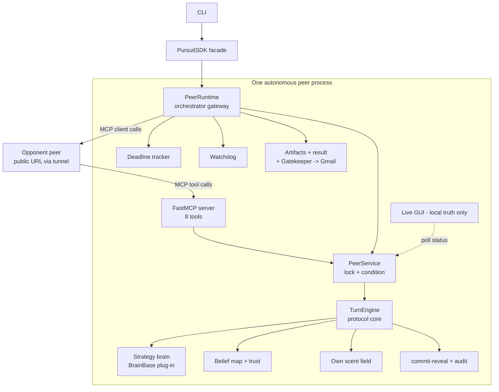
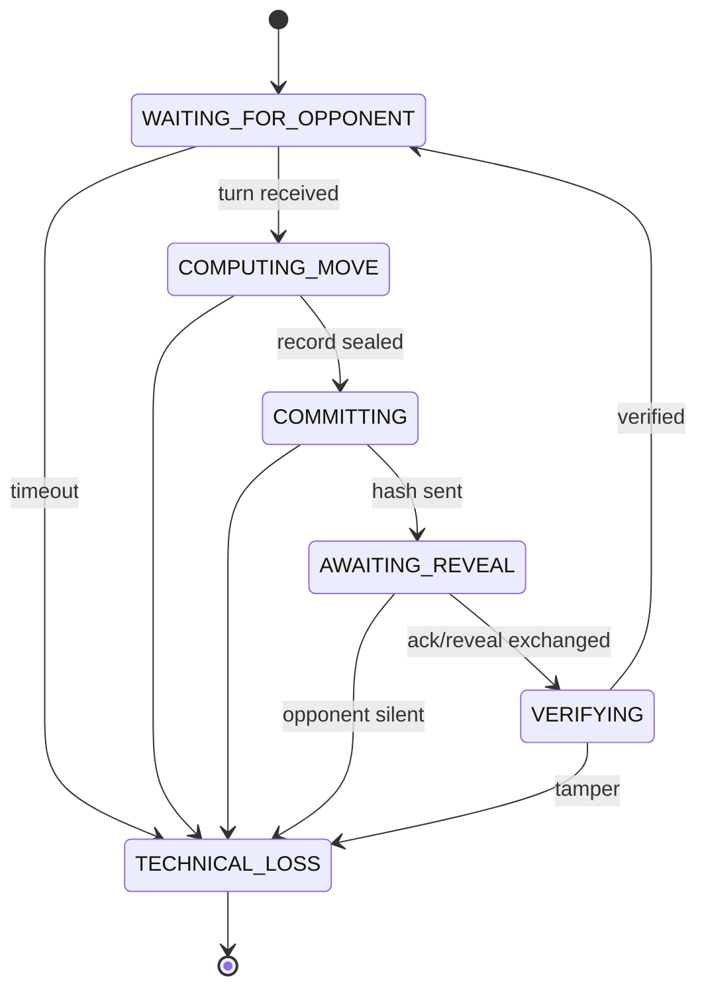

# PLAN — Architecture & Work Plan: Distributed Cops-and-Robbers over P2P

Companion to [`PRD.md`](PRD.md) (requirements) and [`TODO.md`](TODO.md) (task tracking).
Stage-by-stage requirements live in [`docs/PRD/`](PRD/) (seven PRDs, book §10.3).

---

## 1. Architecture decisions (ADRs)

### ADR-1 — Build fresh; reuse HW6 assets; treat the reference repo as a contract, not a skeleton
The book states the reference repo (`rmisegal/Game-P2P-Cop-Chase`) is a *learning aid, not a
submission skeleton*, and our HW6 architecture (central orchestrator + authoritative referee)
contradicts the P2P zero-trust model at its root (see `GAP_ANALYSIS.md`). **Decision:** new
codebase, book-shaped architecture; port proven HW6 assets (Gatekeeper, Gmail/OAuth sender,
config-manager patterns, CI/test discipline); keep our MCP tool contract and artifact schemas
**wire-compatible** with the reference implementation, since league opponents will likely derive
from it (verified in warm-up games).

### ADR-2 — One role-configurable codebase, delivered as two repos
The submission demands two separate repos (police, thief) with cross-links; the runtime demands
two fully separate processes with separate `/config/police` and `/config/thief` — but nothing
forbids the two repos sharing *stateless* code heritage. **Decision:** develop one package
(`p2p_pursuit`) where role is pure config; publish to **two self-contained repos**
(`p2p-police-agent`, `p2p-thief-agent`) via a scripted sync (no submodules — the grader must see
complete standalone repos). Each repo carries the full docs set and its own CI.
*Amended at split time:* both repos ship **both** config dirs — the test suite and `sim` load
`config/police` + `config/thief`, and CI must stay green in each repo standalone; the per-repo
role identity is instead a one-line `ROLE` marker (written by `scripts/sync_repos.py`) that
`peer` uses as its `--role` default. The zero-shared-state rule (#1–2) is a **runtime** invariant:
no module holds live state accessible to both processes; enforced by design + a test that scans
for shared mutable module-level state.

### ADR-3 — Move policy: deterministic search under belief; LLM = banter only
Default and reference-compatible: `template` provider, zero tokens, fully offline. Move choice is
pure Python (belief-driven heuristics + bounded search), unconditionally legal via the Stage-1
validator, and never blocked on any network call. LLM-driven tactics only if a specific opponent
mutually agrees — off by default.

### ADR-4 — Tech stack
Python 3.13 + `uv`; FastMCP (server+client); Tkinter (GUI + replay — stdlib, no deps);
`hashlib`/`secrets` (crypto); `jsonschema` (artifacts/config); `google-api-python-client` +
`google-auth-oauthlib` behind an optional extra (`--extra gmail`); optional extras for `ollama`
/ `anthropic`; pytest + coverage ≥85%; Ruff; files ≤ ~150 code lines; English-only comments.

### ADR-5 — Canonicalization discipline
All hashed payloads (commits, config lock, scent-model lock, declarations) serialize as canonical
JSON: `sort_keys=True, separators=(",", ":"), ensure_ascii=False, UTF-8`. One function
(`domain/crypto.py:canonical_bytes`) is the only entry point — golden cross-platform tests pin it.

## 2. Architecture diagrams (C4-style)

### 2.1 Container view — one peer (both peers are identical)



### 2.2 Turn state machine (book ch. 8.3, enforced table)



### 2.3 One step over the wire (sequence)

```mermaid
sequenceDiagram
    participant M as Mover
    participant O as Observer
    M->>M: brain decides move+hint+intent, seal record
    M->>O: receive_commit(hash only)
    O-->>M: ack (locked)
    M->>O: receive_reveal(public: hint, scent, barrier[, claim])
    O->>O: belief update; forced events (confession / claim answer)
    O-->>M: events (sealed envelopes)
    Note over M,O: sub-game end: audit_exchange(full sealed log + nonces) both ways
```

## 3. Module layout (target tree)

```
src/p2p_pursuit/
  __main__.py cli.py             # thin arg-parsing shell over the SDK
  sdk/sdk.py                     # PursuitSDK - the single business-logic entry point
  domain/                        # stage 1+4+6 pure logic (no I/O)
    board.py rules.py scoring.py         # PRD-1
    scent.py belief.py trust.py hints.py # PRD-4
    crypto.py protocol.py audit.py       # PRD-6
    declarations.py negotiation.py game_ids.py
    brains_base.py                       # BrainBase plug-in contract (PRD-3)
  strategy/                      # OUR graded brains + banter providers
    police_brain.py thief_brain.py pathing.py
    talk_template.py talk_llm.py
  peer/                          # PRD-2 runtime
    engine_state.py turn_engine.py       # protocol core (state + handlers)
    service.py runtime.py runtime_reports.py
    local_match.py                       # in-process series driver (tactics lab)
    state_machine.py deadline.py watchdog.py
    log_manager.py audit_bridge.py
  infra/                         # I/O adapters
    mcp_server.py mcp_client.py transport.py email_sender.py
  report/                        # PRD-7 artifacts
    artifacts.py results.py
  gui/                           # PRD-7 views (pure logic separated from Tk shells)
    view_model.py live_view.py replay_data.py replay_view.py
  shared/
    config.py gatekeeper.py rate_limiter.py sysinfo.py version.py logging_setup.py
config/police/ config/thief/     # game.json + game.toml + rate_limits.json per role
config/logging_config.json
notebooks/strategy_sweep.py      # parameter-sensitivity runner (guidelines §9)
matches/                         # tracked per-match artifact archive (Appendix F)
tests/unit/ tests/integration/   # mirrors src/
docs/  PRD.md PRD/ PLAN.md TODO.md STRATEGY.md RUNBOOK.md
       PROMPT_BOOK.md COST_ANALYSIS.md GAP_ANALYSIS.md
```

Per-turn dataflow (each peer, symmetric):
**observe** (opponent scent + incoming hint) → **belief update** (Bayes: motion ⊕ scent ⊕
trust-weighted hint) → **brain decides** move/barrier + hint + intent → **commit** (SHA-256) →
ack → **reveal** → **verify opponent's reveal** (legality + consistency) → **log** sealed record
→ GUI refresh. After both sides moved: scent decay tick.

## 4. Reuse map

| Asset | From | Into | Work |
|---|---|---|---|
| Gatekeeper (rate limit/retry/log) | HW6 `shared/gatekeeper.py` | `shared/gatekeeper.py` | + token-bucket, quota manager, DOS detector |
| Gmail OAuth sender (mockable) | HW6 `reporting/gmail_reporter.py` | `infra/email_sender.py` | JSON-attachment format; draft/send modes |
| Config schema loading | HW6 `shared/config.py` | `shared/config.py` | dual JSON/TOML contract + overlay + canonical hash |
| Smoke tool pattern | HW6 `mcp/smoke.py` | `cli.py smoke` | tool-contract probe |
| CI, Ruff, pytest, uv discipline | HW6 | both repos | copy + adjust |
| Turn-loop/technical-loss/safe-fallback know-how | HW6 orchestrator | `peer/turn_loop.py` | rewrite for P2P state machine |
| Search-under-rules concept | HW6 `strategy/search*` | `strategy/search.py` | rewrite: 4-orthogonal, barrier-turn, belief state |
| Interface conventions (`BrainBase`, `[strategy]`, `[trash_talk]`, artifact names, ports 8801/8802) | reference repo | contract layer | conform, don't copy |

## 5. The seven build layers → milestones

| # | Layer (PRD) | Gate (binary, from book §10.4) |
|---|---|---|
| M1 | Base logic | legal movement, barrier/quota/capture/enclosure/scoring proven end-to-end locally |
| M2 | MCP infra | geometric message A→B over localhost; kill/freeze drills pass; state machine + watchdog live |
| M3 | Blind strategy | shortest-path execution given a known target; v1 brains beat random baselines |
| M4 | Language + scent | scent updates/decays per formula; free-text → inference; lie drops trust coefficient |
| M5 | Cloud + tunnel | full sub-game over ngrok between two machines; tunnel-kill ⇒ clean technical loss |
| M6 | Crypto | commit→ack→reveal→audit over the wire; adversarial cheat harness always caught; step-0 exchanged |
| M7 | Reporting shell | four artifacts + Gmail (draft) auto-sent; GUI live; replay `Verified OK`; bucket/DOS drills pass |

**No layer starts before the previous gate is demonstrably green** (book: skipping layers turns
every bug into a multi-variable investigation).

Suggested calendar (adjust to deadline): M1–M2 week 1 · M3 week 2 · M4 weeks 2–3 · M5 week 3 ·
M6 week 4 · M7 week 5 · league warm-ups + counted matches week 6 · polish/submission week 7.

## 6. Strategy design (the graded core)

### 5.1 Belief engine
Grid posterior `b(s)`; per turn: (1) **diffuse** through the opponent-motion model (uniform over
legal one-step moves, barrier-aware); (2) **scent likelihood** — for each cell, expected τ pattern
given "opponent was here k turns ago" vs observed field (freshness ranking is the strongest
signal: τ≈0.81 ⇒ was adjacent last turn); (3) **hint likelihood** — parsed direction/landmark
region scaled by trust `w∈[0,1]`; (4) normalize. Trust update: Beta-style — hint corroborated by
scent ⇒ `w↑`, contradicted ⇒ `w↓` hard (book's canonical lie-detection example is a unit test).

### 5.2 Police tactics
- **Pursuit:** BFS distance (barrier-aware) to belief argmax; tie-break by expected posterior-
  entropy reduction (prefer moves whose scent observations discriminate hypotheses).
- **Barrier doctrine:** barriers cost a turn (no move), quota 14 → each is an investment.
  Phases: *early* — none (information-poor); *mid* — corridor pinching when belief mass ≥ threshold
  near an edge/corner: seal the escape ring cell-by-cell; *end* — pocket closing; *kill shot* —
  if `b(adjacent cell)` ≈ certain, place the barrier **on** it (barrier-capture).
  Safety invariant: flood-fill connectivity check — never wall ourselves off from the belief mass;
  keep ≥2 quota reserve for the endgame.
- **Deception:** hints herd the thief — announce false position to push him toward sealed pockets;
  intent flag = `lie` sealed in the commit (legal, provable, premeditated).

### 5.3 Thief tactics
- **Evasion objective:** maximize `E_b[dist(police, ·)] + λ·mobility − μ·scent_risk`;
  mobility = open orthogonal neighbors (avoid corners until late); barriers are public truth —
  path around forming pockets immediately.
- **Scent management:** never STAY twice (re-emission concentrates τ); prefer paths increasing
  distance from own scent centroid; near step 30+, prioritize survival distance over freshness.
- **Scent-consistent lying:** generate hints that fit our *decayed* trail (claim the region we
  left 3–4 turns ago) so the opponent's contradiction detector reinforces the lie instead of
  burning our trust score. Occasional true hints keep `w` (their trust) exploitable.
- **Police-reading:** their scent reveals their patrol; predict interception courses and steer
  orthogonally to their approach axis.

### 5.4 Evaluation loop
The Stage-3 sim-runner becomes the tactics lab: seeded self-play tournaments (v-next vs v-prev,
vs random, vs reference-repo brain), win-rate + capture-time + survival-rate regression bounds in
CI; findings recorded in `docs/STRATEGY.md` (our repo's strategy report — also useful evidence
for the academic README).

### 5.5 Excellence extensions (backlog, in priority order)
1. Particle-filter belief (handles multi-modal posteriors better than a grid Bayes on big boards).
2. Bounded expectimax over belief states for the police endgame.
3. Articulation-point barrier analysis (graph-theoretic safe sealing).
4. Opponent-adaptive lie policy (model their trust updates; lie when it pays).
5. Auto-negotiation advisor (propose legal parameter deals that favor our brains, e.g. board size).
6. Analytics notebook: token/cost model per provider, win-rate parameter sweeps (echoes the
   reference `RESEARCH-REPORT-Performance-Analysis.md` — the book explicitly recommends replicating
   that analysis for our own plan).
7. A2A-style task-lifecycle states (`submitted`/`working`/`completed`) layered over match
   management, per the book's "highly recommended" pointer to the A2A/ACP protocols (MCP remains
   the mandated wire protocol — this is bookkeeping semantics only).

## 7. League operations

1. **Warm-ups first** (uncounted, declared as such): interop check vs reference-derived peers —
   tool contract, artifact schemas, scent-lock exchange.
2. Per counted match: negotiate constitution (**incl. first mover** — book leaves it open; we
   propose thief-first — and any mutually agreed rule upgrades, which the book encourages) →
   lock config + scent model (SHA-256) → step-0 declarations (incl. our current commit hash) →
   play 6 sub-games → mutual audit → agree result → **both sides email reports** → commit the
   per-match config + artifacts to the repos → record any interpretation decisions in the README
   interpretation log (academic-freedom clause).
3. Truthful counted-game declaration before each match; stop at one counted game per opponent;
   target 2–3 counted matches vs different teams (pass gate = 2), hard cap 10.
4. Evidence kit per match: GUI screenshots, replay `Verified OK` screenshot, terminal output,
   Gmail message id.

## 8. Risks & mitigations

| Risk | Mitigation |
|---|---|
| Opponent implementations diverge from the book | wire-compat with the reference repo; warm-up interop games; strict-but-tolerant parsers; handshake rejects config mismatch early |
| Canonicalization mismatch across OSes/teams | single `canonical_bytes` entry point; golden vectors; pre-series scent-lock includes a numeric example |
| Free-tier tunnel URL churn / mid-game drop | runbook for URL rotation; reconnect-within-timeout; clean technical-loss path drilled |
| Turn deadlock (both waiting) | state machine + deadline tracker + watchdog; chaos tests in CI |
| Gmail account lockout (429 / loop bug) | Gatekeeper (bucket + quota + DOS lock); draft-mode default in dev |
| Secret leakage to repos | `.gitignore` before first commit; pre-commit secret scan; two-repo sync script excludes secrets |
| LLM latency stalls a turn | banter async with per-step deadline; template fallback; `every_n_steps` |
| Two-repo drift | scripted sync + CI on both; single source of truth workspace |
| Late discovery of grading gaps | PRD §6 rule map reviewed at every milestone; final pre-submission checklist (TODO §9) |

## 9. Quality gates (every PR)
`uv run ruff check` clean · `uv run pytest --cov` ≥85% · file-length lint (≤~150 code lines) ·
no-secret scan · sim-runner regression bounds green · docs updated with the change.
